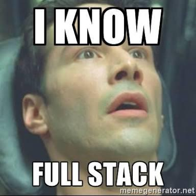

[Pesentation MainPage](readme.md)

Subsections:

1. [The story so far](#storySoFar)
2. [Front-End Ecosystem](#FE_Echosystem)
3. [Text Editors](#TextEditors)

---

<h1 id="storySoFar">The story so far</h1>

## The term "Front-End"

Back in the days, there was no such thing as Front-End Development or Back-End Development, there was just DEVELOPMENT.  You just started developing the app and that was it. Some people still do that but the trend is to keep things separated.

In general, the term front-end refers to what happens in the User Interface (UI). The front-end part acts as an interface between the client and the server. It handles what the user  sees and how he sees it. It also provides interactivity and sends back responses to the server when needed. Modern programming is not just about Input and Output (I/O), there are certain rules and mechanism that have to be implemented to better handle the user's interactions with the server. Not every user action needs to be acknowledged by the server, some things can stay in the front-end for a better abstraction and performance.

When talking about the web, there are 3 major technologies that handle the front-end part. I like to use this little comparison to explain their role. Imagine that you want to build a sentence, you basically need 3 components: 

> 1. The noun : HTML - offers the semantic structure, pointing out what things are, e.g. "*car*"
> 2. The adjective: CSS - describes the attributes of the non, e.g. "*red dog*"
> 3. The verb: JavaScript - describe how the noun interacts, what it does, how it does it and when, e.g. "r*ed dog that barks wen it sees a cat*"
>

Obviously, JavaScript is the core component here, no mater if other programmers like it or not, JavaScript is the language of the web and it's here to stay.

### Full-Stack Development.

There are, of course, many many kinds of developers and many types of development. Someone who builds and APP from the ground up, handling any kind of development tasks can safely call himself a "Full Stack Developer".

|                           |                           |
| ------------------------- | ------------------------- |
|  |  |

Although being a full stack developer sound good in theory and it does play out well when you are doing freelancing or other more specialized types of development, most of the times it's best for the business and for the developer to specialize in a certain field. Big companies and complex projects require specialized developers and we can all agree that one person can't know everything, one has to decide what type of development he wants to do.

### The increasing need for Front-End Development

Apps tend to be more and more complex, in order to keep thins separated it's divide one big problem into smaller ones. After all, software development is about find solutions for certain problems, including business problems. Many a few years ago, not having a responsive website was not such a big deal, everyone was using big old computer screens, and only a fool would press "the internet button" on his mobile phone. Nowadays, if it's not looking good on a mobile device, you'd better take that website down.

A more recent problem that has occurred , specially in web applications is how they "feel" like. This "feel" is being handled by the front-end teem. The way that an app looks is a Front-End developer's main job. Also, a very impotent aspect is the performance one. Using a front-end approach, you can take the load out of the server and do the processing in the client's browser. This reduces server traffic and also separates concerns for better testability.

Front-End developers work closely with designers. The increasing need for "fancy" website will require more and more designers and Front-End developers. Before people figured out what a Front-End developer does, they used to call them "Web-Designers" (old fashioned JAVA programmers still do) , now, the term designer is usually associated with someone with someone who handles the "artistic" part of a website, without writing any code. 

I think that we should all be mature enough to respect each other's jobs. There is a common joke that you will hear stating that Front-End developers are not "real" developers, but I've also seen hardcore back-end developers who struggled for hours to canter some text properly. 

**By separating concerns, everyone can focus on what they do best.**

### Why choose Front-End Development? 

|                                     |                                      |
| ----------------------------------- | ------------------------------------ |
|  |  |

**Technical Reasons:**

First of all, someone has to do it, but there are a couple of good technical reasons why:

1. Better Performance
2. Easier to Maintained
3. Easier to Test
4. Better Looking

**Professional** Reasons:

1. It's fun : you gen to work with designers and be a part of the creative process
2. It's more approachable than other types of development : easier to learn, plenty of resources, great community
3. Highly interactive and rewarding : you can see the results of your work medially, you get to say "I made this" because this is what the users see, may times the work of a back-end developer is invisible
4. Plenty of freelancing : everyone wants a website today
5. It's here to stay : very few small companies have the luxury of not having someone who does front-end development(even if it's not full-time)

---

<h1 id="FE_Echosystem">Front-End Ecosystem</h1>

Now that we've established what Front-End Programming is and why should we do it, let's deep dive into the architecture.

We will only cover Front-End WEB development, as the term front-end can apply to other kinds of development as well.

### The browser environment.

The best part about web development is that you don't need to force the client to install anything in order to run your app. All that he need is a web browser.

### Browser APIs

---

<h1 id="TextEditors">Text Editors</h1>

Theoretically, you can use any kind of text editor to write your code. In practice, there are tools that make your life a whole lot easier.

##### Productivity benefits:

- Syntax Highlighting
- Auto Completion
- Shortcuts
- Linters
- Auto Formatting
- Integrated Web Servers
- Version Control Integration
- Other Plugin Integration

### Smart Text Editors 

- Atom Editor
- VisualStudio Code
- WebStorm
- Brackets
- Sublime Text

### Online Environment

- Codepen
- jsfiddle
- jsbin

### Cool Atom plugins

[Beautify](https://atom.io/packages/atom-beautify)

[Live Server](https://atom.io/packages/atom-live-server)

[Emmet](https://atom.io/packages/emmet)  documentation here : [emmet.io](http://emmet.io)

[Open in Browser](https://atom.io/packages/open-in-browsers)

----

