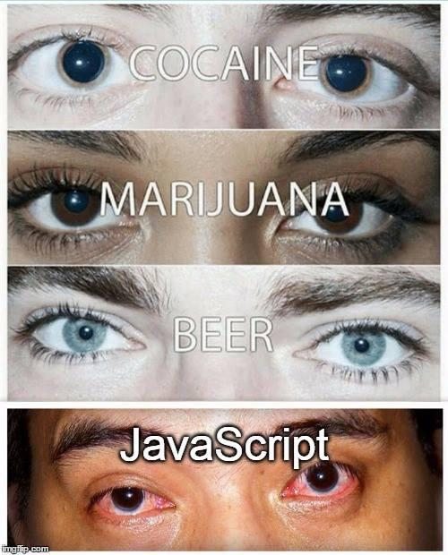
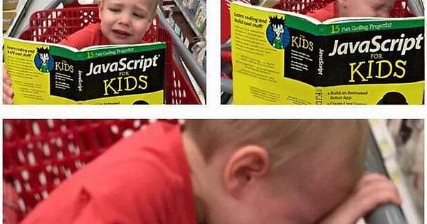

Subsections:

1. [Why JavaScript?](#whyJS)
2. [JS distinctive Characteristics](#distinctiveCharacteristics)
3. [The basics of programming with JavaScript](./03.01_JavaScriptBasicProgramming.md)
4. Manipulating the DOM
5. JavaScript events
6. AJAX
7. ES6
8. JavaScript libraries : jQuery

---

<h1 id="whyJS">Why javaScript?</h1>

#### Fasters Growing Programming language

#### The JS Stack

JavaScript runs natively in the browser but it can also run on the server: Node.js using Chrome's V8 engine.

#### A gateway programming language

JavaScript supports many programming paradigms and design patters.

You can use JS to write Object-Oriented code or Function Oriented code (functional programming)

#### Good for beginners

Now that we watched some quality memes (which is what Front-End developers do 80% of their time) let's get started with JavaScript.

<h2>JavaScript Distinctive characteristics</h2>

1. Loosely Typed
2. Single Threaded 
3. Object-Oriented (prototypal)
4. Asynchronous (non-blocking)
5. Runs natively in the browser

----

<h1 id="distinctiveCharacteristics">JS distinctive Characteristics(compared to other programming languages</h1>